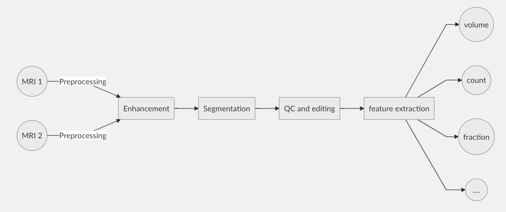

# MVP Documentation

This is the documentation for Mapping Vascular and Perivascular spaces (MVP) toolset, which is written to help with automated mapping of vascular and perivascular features of the brain from neuroimaging data. 

## Big picture
MVP consists of several modules related to mapping vascular and perivascular spaces of the brain from neuroimaging data. It also contains number of pipelines that connect these modules to automatize the process. An example big picture of the modules are presented below. Detailed examples and demos are provided.

The goal is to have optimum pipelines depending on the input image (input contrasts, resolution, study population, etc). For example, to map perivascular space, we found that combining T1w and T2w MRI provide the highest contrast. Or if an aging-related clinical cohort is being studied, T1w and FLAIR images could be combined to map white matter hyperintensities, or correct for false postive PVS.

## Toolset modules
The toolset consists of tools to map:

- Perivascular Spaces ([PVS](pvs.md))  
- White Matter Hyperintensities (WMH)  
- Cerebral vessels  
- ...

** the document is under construction **