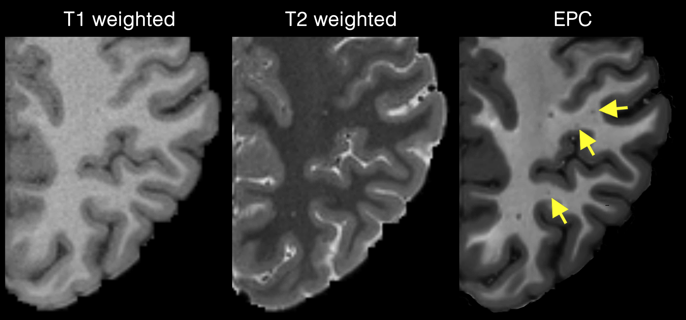

# PVS Mapping Pipelines 

On this section, several pipelines are presented that enable automated PVS mapping from different input data scenarios. 

Here we share pipelines that are tested on certain datasets (e.g. [Human Connectome Project](https://www.humanconnectome.org) or [ADNI](http://adni.loni.usc.edu) cohorts). These pipelines allow users to have a simple and fast implementation of the PVS mapping. Underlying modules and image processing approaches used in these pipelines are descripted in this [paper](https://www.nature.com/articles/s41598-019-48910-x). 


!!! note
	These pipelines are validated and tested on specific data with certain CNR and SNR. These pipelines may not be optimized for all datasets or applications. Therefore users should perform visual inspection and parameter optimization.

## Mapping PVS using EPC (T1 and T2)
This pipeline is written for when both 3D T1 and 3D T2 MRIs are available, which provides a high sensitivity to PVS. The ideal input for this pipeline is HCP-like data (i.e. submilimeter 3D T1w and T2w).  

T1w and T2w should be preprocessed using HCP minimal preprocessing pipeline (users can use their own preprocessing, but should ensure that T1 and T2 are aligned and are saved using below naming conventions). The pipline reads `T1w_acpc_dc_restore_brain.nii.gz`, `T2w_acpc_dc_restore_brain.nii.gz`, `wmparc.nii.gz` and `ribbon.nii.gz` files and generates enhanced PVS contrast (EPC). It also generates PVS mask in white matter and basal ganglia and quantifies PVS volume fraction in these regions using `wmparc` labels. For more information about white matter regions of `wmparc` see [this paper](https://surfer.nmr.mgh.harvard.edu/ftp/articles/desikan06-parcellation.pdf).

To run the pipline, use:

    mvp.pvs.epc.sh -f path-to-study -s subject-id [-t segmentation-threshold] [-w white-matter-segmentation] [-b basal-ganglia-segmentation] [-i input-image] [-o output-folder-name]

Arguments of `mvp.pvs.epc.sh` are:

```text
Required aruguments:
-f : path to the study folder (e.g. -f /data/projects/adni)  
-s : subject ID (e.g. -s subj-01)

Optional arguments: 
-t : threshold to be applied on vessel likelihhood [default = 0.00002]  
-w : segment PVS in white matter. set -w 0 to skip white matter [default = 1]
-b : segment PVS in basal ganglia. set -b 0 to skip basal ganglia [default = 1]
-i : input MRI. set 0 to use both t1 and t2, set to 1 for T1 and 2 for T2 [default = 0]
-v : remove PVS larger than X voxels (e.g. -v 100) [default = do nothing]
-o : name of the output directory [default = pvs]
```

The pipeline assumes a repository format similar to HCP repositories. 

```
study-folder
		|___sub-01
				|___T1w
					|___T1w_acpc_dc_restore_brain.nii.gz
					|___T2w_acpc_dc_restore_brain.nii.gz
					|___wmparc.nii.gz				
```

After running this pipeline, a `$output-folder-name` will be added. We suggest `-o pvs` for output name, which is the default value. The output folder will contain pvs mask `pvs.mask.nii.gz` and a directory containing PVS volume fraction across white matter `pvs.stat/`. Other intermediate files are also stored in the same folder.

For example, this code will generate below outputs. 

    mvp.pvs.epc.sh -f ${MVPDIR}/example/hcp-like_example -s sub-01

```
study-folder
		|___sub-01
				|___T1w
					|___T1w_acpc_dc_restore_brain.nii.gz
					|___T2w_acpc_dc_restore_brain.nii.gz
					|___wmparc.nii.gz
				|___pvs
					  |___epc.nii.gz
					  |___pvs.mask.nii.gz
					  |___pvs.stat
					  		|___wm.csv
					  		|___wmparc.csv
```

EPC image has a significantly higher PVS contrast in comparison with T1w and T2w, which is suitable to map small PVS and detecting PVS from background noise. 



If a same acquisition as HCP is used for your data, we recommend to use the defaul threshold, which we have optimized specifically for HCP data [ref](link). The optimum is `-t 0.000001` (around `1.5` when the threshold was standardized across Frangi outputs range for the tested HCP sample - for more information please see the EPC paper). If the defaul threshold did not provide the optimum results in your data, we recommend a number around the default value. 

!!! tip
	In order to find the optimum threshold for your dataset, run the existing pipeline with default values. Then overlay `sub-01/pvs/frangi.nii.gz` on EPC image `sub-01/pvs/epc.nii.gz` and assess different thresholds. You can then create a new PVS mask using `fslmaths frangi.nii.gz -thr $new_threshold -bin new_pvs_mask.nii.gz`


Alternatively, you can use automated threshold identification techniques to find the optimum threshold for your data. More information about automated threshold identification will be added in the future.

### Mapping PVS in BG
Currently, for basal ganglia PVS segmentation MVP only uses T2 MRI. This is done by default and no set up is required. If you wish to segment BG PVS using T1, set `-i 1` (which is not recommended if T2 is available).

Note that both WM and BG segmentation will be done using the same threshold. to use different threshold for each region, users should run the `mvp.pvs.epc.sh` command twice, similar to below examples:

```bash
# Skip BG and use t=0.00001 for WM
mvp.pvs.epc.sh -f ${MVPDIR}/example/hcp-like_example -s sub-01 -w 1 -b 0 -t 0.00001
# Skip WM and use t=0.00005 for BG
mvp.pvs.epc.sh -f ${MVPDIR}/example/hcp-like_example -s sub-01 -w 0 -b 1 -t 0.00005
```  
Results from both of above commands will be stored in `study-folder/sub-id/pvs`.

!!! note 
	We noted that BG PVS mapping is less stable compared to WM PVS mapping. Hence, it requires visual inspection and most likely manual correction.

### Mapping PVS from only T2 MRI
This pipeline can be used for PVS mapping using only one of 3D T1 or 3D T2 MRI on HCP-like data. Note that when both are  available the EPC approach is recommended. We added this option because there are certain situations that user may want to derive PVS from only T1 or T2. For example, when T1 and T2 could not be aligned. Or when one is distorted.  

To run this pipeline, we assumed the MRI has been preprocessed using HCP minimal preprocessing pipeline. The folder configuration therefore would be similar to the EPC example. 

To run the PVS pipeline on single data, use `-i` argument. Use `-i 1` for T1 and `-i 2` for T2. Default takes both images (`-i 0`). Here is an example of running this pipeline only on 3D T2 MRI: 

    mvp.pvs.epc.sh -f ${MVPDIR}/example/hcp-like_example -s sub-01 -i 2 -o pvs_t2

Optimum thresholds for this task are `t=0.02` and `t=0.01` for T1 and T2, respectively. These thresholds are set as the default value. Similar to above examples, assess the quality of the PVS segmenation and ensure the threshold is optimum for your dataset. 

## Mapping PVS from typical T1 MRI
Here by "typical T1 MRI" we are referring to conventional 1mm<sup>3</sup> T1-weighted MRI, which is often used in clinical studies such as ADNI. Such data is not optimal for PVS mapping due to the low resolution and lack of accompanying 3D T2-weighted MRI. However, these images can still be used to high caliber PVS.

MVP uses the output of FreeSurfer `recon-all` as the input to the PVS mapping pipeline. The pipline reads `T1.mgz` and `wmparc.mgz` files and generate PVS mask and quantifies PVS volume fraction globally and across white matter regions, defined by `wmparc`. For more information about white matter regions of `wmparc` see [this paper](https://surfer.nmr.mgh.harvard.edu/ftp/articles/desikan06-parcellation.pdf).

To run the pipline, use:

    mvp.pvs.fsout.sh -f path-to-study -s subject-id [-t segmentation-threshold] [-b basal-ganglia-segmentation] [-o output-folder-name]

Arguments of `mvp.pvs.fsout.sh` are:

```text
Required aruguments:
-f : path to the study folder (e.g. -f /data/projects/adni)  
-s : subject ID (e.g. -s subj-01)

Optional arguments: 
-t : threshold to be applied on vessel likelihhood [default = 0.00002]  
-b : also segment PVS in basal ganglia. set -b 0 to skip basal ganglia [default = 1]
-v : remove PVS larger than X voxels (e.g. -v 100) [default = do nothing]
-o : name of the output directory [default = pvs]
```

The pipeline assumes a repository format similar to BIDS. And expect to have a folder called `fsout` containing output of FreeSurfer `recon-all`.

```
study-folder
		|___sub-01
				|___anat
				|___fsout				
```

After running this pipeline, a `$output-folder-name` will be added. We suggest `-o pvs` for output name, which is the default value. The output folder will contain pvs masks (`pvs.mask.nii.gz` and `pvs.bg.final.nii.gz`), and a directory containing PVS volume fraction across white matter and basal ganglia (`pvs.stat/`). Other intermediate files are also stored in the same folder.

An example is included in the repository which can be tested by running below command: 

    mvp.pvs.fsout.sh -f ${MVPDIR}/example/fs_example -s sub-01

The output of above command is:

```
study-folder
		|___sub-01
				|___anat
				|___fsout
				|___pvs
					  |___pvs.mask.nii.gz
					  |___pvs.stat
					  		|___wm.csv
					  		|___wmparc.csv
```

This example uses the default threshold value of `-t 0.00002` and output folder name of `pvs`. Optimum threshold depends on input image quality and resolution. Above threshold showed to generate semi-optimum result on clinical 3D T1 MRI, such as those acquired in ADNI dataset [[ref]](https://www.biorxiv.org/content/10.1101/2020.01.30.927350v1.abstract). 

Similar to [EPC example](#mapping-pvs-using-epc-t1-and-t2), in order to find the optimum threshold for your dataset, run the existing pipeline with default values. Then overlay `sub-01/pvs/frangi.nii.gz` on `sub-01/pvs/t1w.nii.gz` image and assess different thresholds. 

!!! note 
	Basal ganglia PVS mapping uses the fixed threshold of 0.0015. Currently no arugment for assigning this number is availble. To use other thresholds, first overlay `sub-01/pvs/frangi.bg.nii.gz` on `sub-01/pvs/t1w.nii.gz` and then apply new threshold using `fslmaths frangi.bg.nii.gz -thr $new_threshold -bin new_pvs_bg.nii.gz`